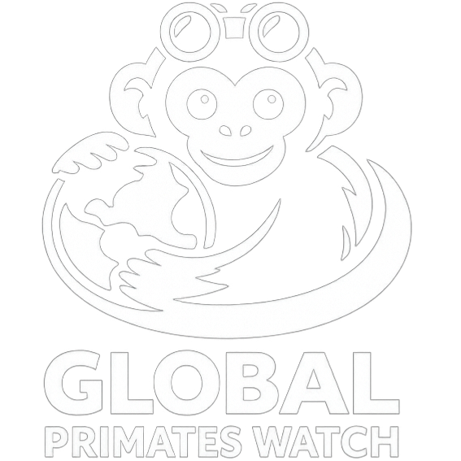

# Global Primates Watch

<p align="center">
  
</p>

<p align="center">
  <strong>Dashboard geoespacial em Streamlit para explorar distribuição, risco de extinção e padrões de conservação de primatas no mundo.</strong>
</p>

<p align="center">
  
  
  
  
</p>

## Visão Geral

O **Global Primates Watch** transforma dados espaciais da IUCN em uma aplicação interativa para análise de primatas. O projeto permite filtrar espécies por categoria IUCN, continente, nível de risco e busca textual, além de visualizar mapas, gráficos e detalhes por espécie.

O app foi pensado para comunicar conservação de forma clara: nomes comuns em português quando disponíveis, categorias traduzidas, mapas interativos e painéis estatísticos para leitura rápida.

## Funcionalidades

- Mapa interativo com agrupamento de espécies e popups em pt-BR.
- Heatmap de densidade para espécies ameaçadas.
- Filtros por categoria IUCN, continente, risco e nome da espécie.
- Métricas gerais de conservação.
- Gráficos por categoria, continente, risco e comparação entre grupos.
- Página de detalhe por espécie com mapa de distribuição.
- Classificação de continente baseada no centroide da distribuição geográfica.

## Como Executar

Crie e ative um ambiente virtual:

```bash
python -m venv .venv
.venv\Scripts\activate
```

Instale as dependências:

```bash
pip install -r requirements.txt
```

Execute o app:

```bash
streamlit run app/main.py
```

Por padrão, o Streamlit abre em:

```text
http://localhost:8501
```

## Dados

O projeto usa dados de distribuição espacial da **IUCN Red List of Threatened Species**. Os arquivos processados esperados ficam em:

```text
data/processed/primates_map.geojson
data/processed/primates_species_clean.csv
```

Se precisar recriar os dados, baixe o pacote espacial da IUCN e execute o fluxo dos notebooks em `notebooks/`.

## Estrutura

```text
Global-Primates-Watch/
├── app/
│   ├── main.py                 # Aplicação Streamlit
│   ├── config.py               # Configurações, cores e textos globais
│   └── components/
│       ├── maps.py             # Mapas Folium
│       ├── charts.py           # Gráficos Plotly
│       └── ui.py               # Componentes de interface
├── assets/
│   └── logo.png                # Logo do projeto
├── data/
│   ├── raw/                    # Dados originais
│   └── processed/              # CSV e GeoJSON prontos para o app
├── notebooks/                  # Limpeza, EDA, visualizações e ML
├── outputs/                    # Exportações e artefatos gerados
├── src/
│   ├── data_loader.py          # Carregamento e enriquecimento geográfico
│   ├── data_processor.py       # Filtros e agregações
│   └── data_utils.py           # Utilitários de dados
├── requirements.txt
└── README.md
```

## Notas Técnicas

- O mapa usa **Folium** e **Leaflet**.
- A interface principal usa **Streamlit**.
- Os gráficos estatísticos usam **Plotly**.
- As categorias de risco seguem a nomenclatura da IUCN, com tradução para português.
- A classificação por continente é aproximada e usa o centroide da geometria da espécie.

## Citação e Uso

Este projeto utiliza dados derivados da **IUCN Red List of Threatened Species**. Consulte os termos oficiais de uso da IUCN antes de redistribuir dados ou usar o material para fins comerciais.

Referência sugerida:

```text
IUCN. The IUCN Red List of Threatened Species.
https://www.iucnredlist.org
```

## Status

Projeto em desenvolvimento ativo para fins de análise, visualização geoespacial e comunicação de conservação de primatas.
